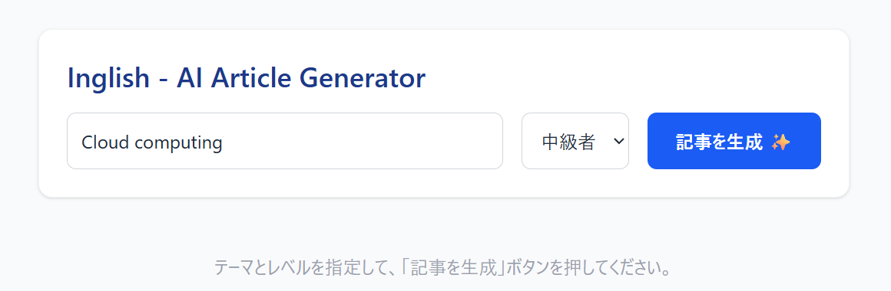
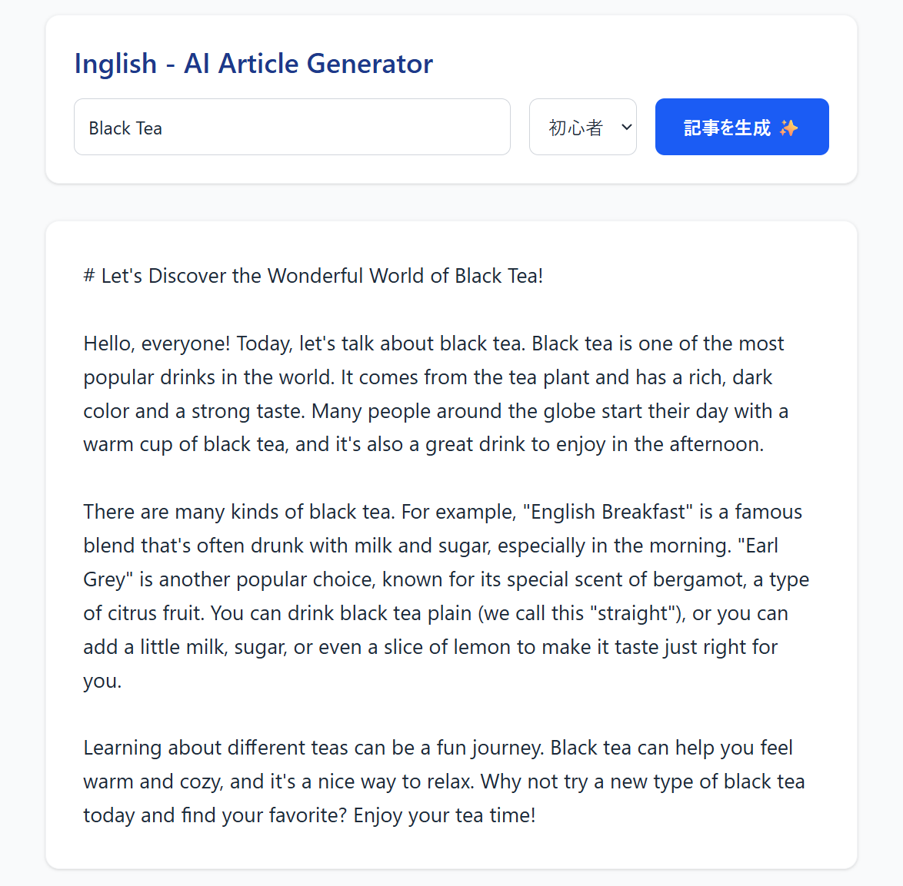
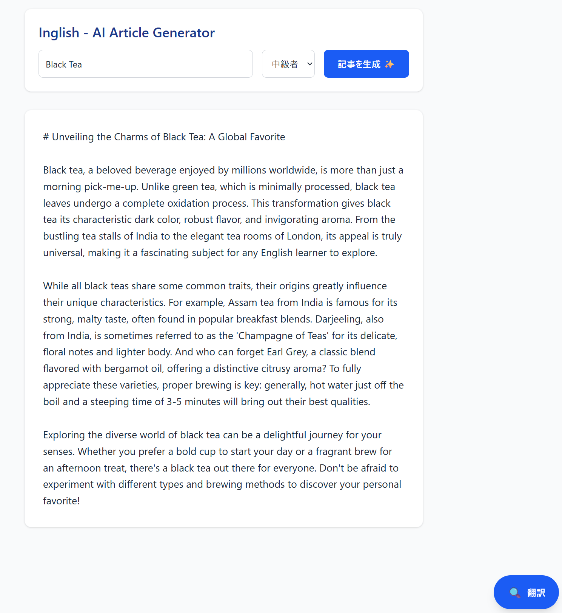
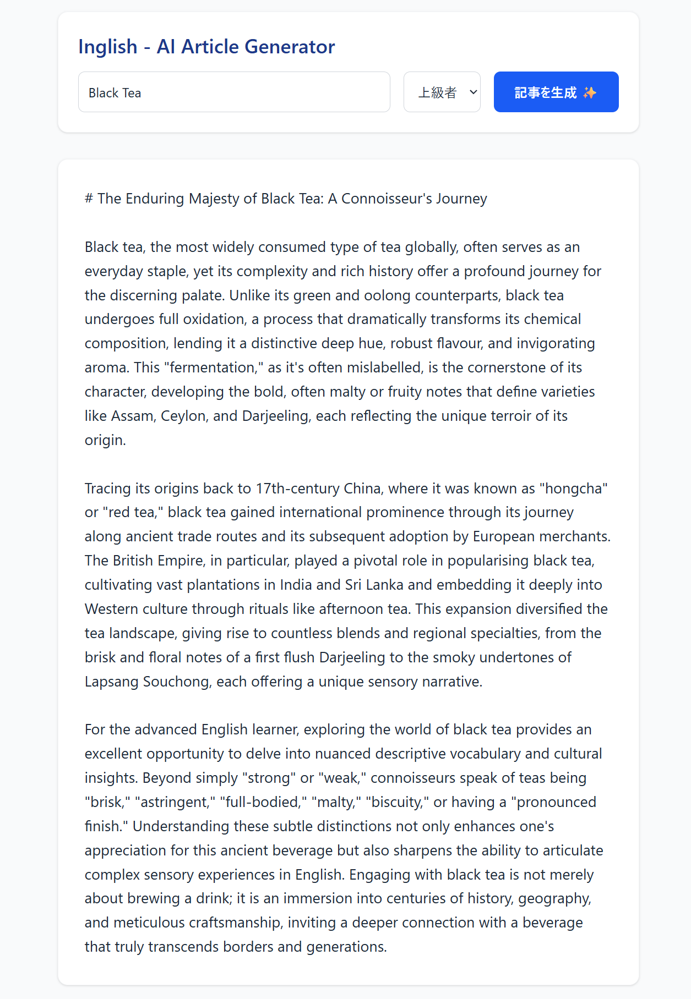
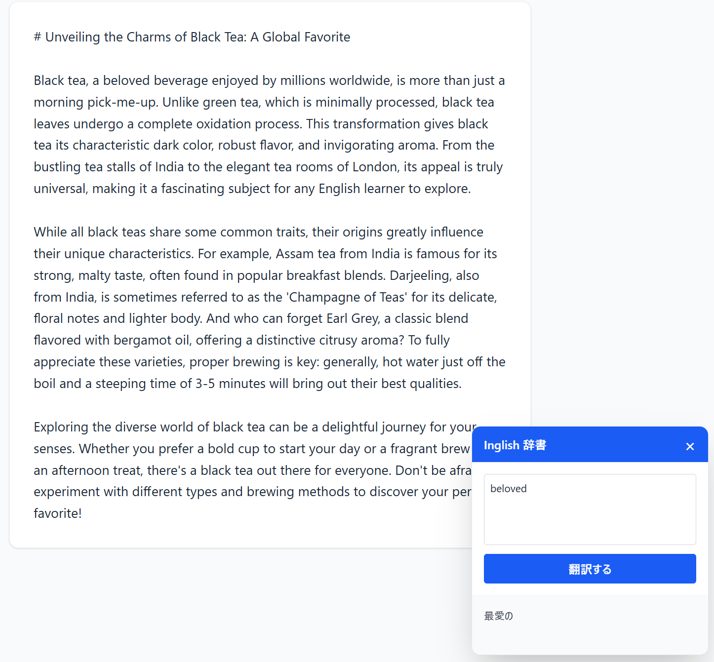

# Inglish - AI Article Generator & Quick Dictionary

Inglishは、AIを活用してユーザーの興味やレベルに合わせた英語学習コンテンツを自動生成するアプリケーションです。
本リポジトリは、将来的に構築予定の「包括的英語学習プラットフォーム」における、**「インプット（リーディングと単語検索）」を担うひとつの機能モジュール（手足）**として開発されました。

RAG（検索拡張生成）による文脈理解とGemini APIを組み合わせることで、単なる翻訳にとどまらない、パーソナライズされた学習体験を提供します。

## Features (機能)

* **パーソナライズ記事生成 (RAG x Gemini API)**
  * ユーザーが入力した「テーマ（例: Black Tea）」と「レベル（初心者 / 中級者 / 上級者）」に基づき、最適な語彙と文法で構成された英語コラムをリアルタイム生成します。
  * バックエンドのChromaDB（ベクトルデータベース）と連携し、関連する文脈を引き出してから記事を生成するRAGアーキテクチャを採用しています。
* **シームレスなミニ辞書ウィジェット**
  * 記事を読みながら分からない単語をその場で調べられる「Inglish辞書」を画面右下に搭載。
  * 学習の集中力を削がないよう、必要な時だけ開閉できるフローティングUIを採用しています。

## Screenshots

### 1. 起動時の画面
テーマとレベル（初心者〜上級者）を選択して学習を開始するクリーンなUIです。


### 2. 記事生成: 初心者レベル (Theme: Black Tea)
初学者でも理解しやすいシンプルな単語と構文で生成された紅茶の要約記事です。


### 3. 記事生成: 中級者レベル
より詳細な情報と、一段階レベルアップした語彙を用いた中級者向けの記事パターンです。


### 4. 記事生成: 上級者レベル
高度な表現や複雑な構文を取り入れ、読み応えのある上級者向けのコラムです。


### 5. ミニ辞書ウィジェット
画面右下のボタンから展開する辞書機能。※「×」ボタンで邪魔にならないよう閉じる（注釈化する）ことも可能です。


## 🛠 Technology Stack

* **Frontend:** React, TypeScript, Vite, Tailwind CSS (v4)
* **Backend:** FastAPI (Python), Uvicorn, Pydantic
* **AI & Data:** Google Gemini API (`gemini-1.5-flash-latest`), ChromaDB (Vector DB)

## Directory Structure

関心の分離（Separation of Concerns）に基づき、フロントエンド、バックエンド、データパイプラインを独立して管理しています。

```text
Inglish/
Inglish/
├── frontend/                 # フロントエンド (React + TypeScript + Vite)
├── backend/                  # バックエンド (Python + FastAPI)
│   ├── app/                  # ルーティング、スキーマ、ロジック
│   ├── vector_db/            # ChromaDBローカル保存先 (自動生成・Git管理外)
│   ├── main.py               # FastAPIエントリーポイント
│   └── requirements.txt      # 依存パッケージ
├── data_pipeline/            # RAG用データ準備スクリプト
│   ├── raw_data/             # ベクトル化する元の英語テキスト
│   └── ingest.py             # ChromaDBへのデータ読み込み処理
├── screenshot/               # README用画像フォルダ
├── .gitignore                # Git管理外設定
└── README.md                 # プロジェクトドキュメント
```

## Future Roadmap

本作は単独のアプリとして一旦完成としていますが、将来的には以下の「包括的英語学習プラットフォーム」のコアシステムに統合される予定です。

* 生成された記事に基づく「理解度クイズ」モジュールとの連携
* 辞書で検索した単語をストックする「パーソナル単語帳DB」との接続
* ユーザーごとの学習履歴に基づいた、最適なテーマの自動提案機能

## Local Setup

本アプリケーションはフロントエンドとバックエンドの2つのサーバーを起動する必要があります。

### Backend (FastAPI)
```bash
cd backend
python -m venv venv
# Windowsの場合
.\venv\Scripts\activate
# Mac/Linuxの場合: source venv/bin/activate

pip install -r requirements.txt
uvicorn main:app --reload
```
※起動前に `.env` ファイルを作成し、`GEMINI_API_KEY` を設定してください。

### Frontend (React)
別のターミナルを開き、以下のコマンドを実行します。
```bash
cd frontend
npm install
npm run dev
```

## License

This project is licensed under the Apache License 2.0 - see the LICENSE file for details.

## Author

**Tatsuya Koyama**
* GitHub: [@ktwpjmmxx](https://github.com/ktwpjmmxx?tab=repositories)