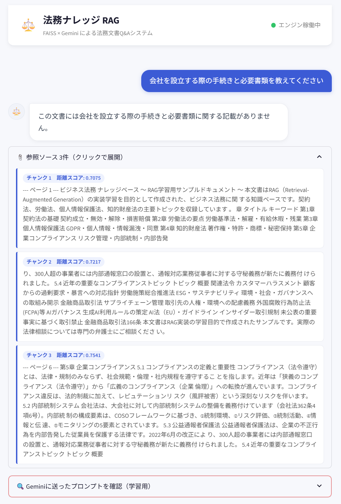
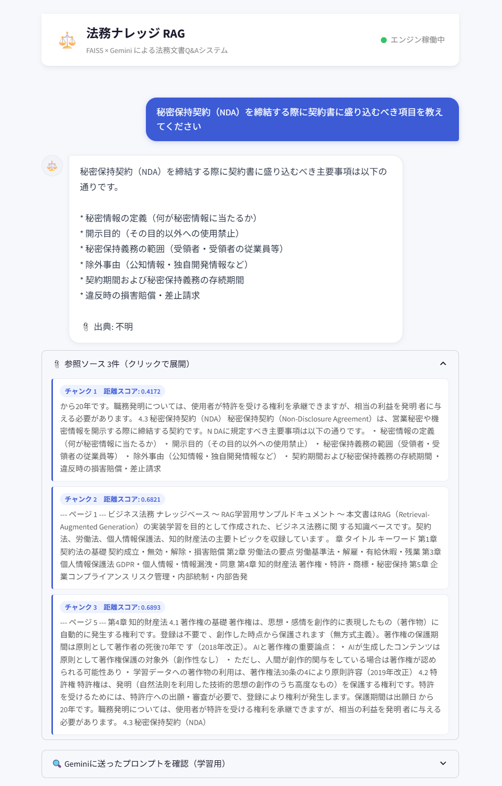

# 法務ナレッジ RAG チャットボット

**FAISS × Gemini API による PDF文書Q&Aシステム**

社内ドキュメント（PDF・Word・テキスト）をベクトルDBに格納し、ユーザーの質問に対して関連箇所を検索・引用しながら回答を生成するRAG（Retrieval-Augmented Generation）アプリケーション。

---

## デモ画面

| 回答なしの質問 | RAG回答 + 参照ソース表示 |
|---------|----------------------|
|  |  |

> **動作例：** 「時間外労働の割増賃金率は？」→ 労働基準法PDFの該当チャンクを3件検索 → Geminiが根拠付きで回答

---

## システム構成

```
┌─────────────────────────────────────────────────────┐
│                   事前処理（ingest.py）               │
│                                                     │
│  PDF/Word/TXT                                       │
│      ↓ テキスト抽出（pypdf / python-docx）            │
│  生テキスト                                          │
│      ↓ チャンク分割（RecursiveCharacterTextSplitter） │
│  チャンク群（500文字 / overlap 100文字）               │
│      ↓ Embedding（Gemini text-embedding）            │
│  ベクトル群（768次元）                                 │
│      ↓ 保存                                         │
│  FAISS インデックス（ローカル永続化）                   │
└─────────────────────────────────────────────────────┘

┌─────────────────────────────────────────────────────┐
│                  質問応答（rag_engine.py）             │
│                                                     │
│  ユーザーの質問                                       │
│      ↓ Embedding（同一モデル）                        │
│  質問ベクトル                                         │
│      ↓ コサイン類似度検索（TOP_K=3）                   │
│  関連チャンク × 3件 + 類似度スコア                     │
│      ↓ プロンプト組み立て                              │
│  [システムプロンプト + 参考情報 + 質問]                 │
│      ↓ Gemini 1.5 Flash                             │
│  回答（文書根拠付き）+ 出典ファイル名                   │
└─────────────────────────────────────────────────────┘
```

---

## 技術スタック

| カテゴリ | 技術 | 選定理由 |
|---------|------|---------|
| フレームワーク | LangChain 0.3 | RAGパイプラインの標準構成 |
| Embedding | Gemini text-embedding | 日本語対応・高精度 |
| ベクターDB | FAISS（Meta製） | C++ビルド不要・ローカル永続化 |
| LLM | Gemini 1.5 Flash | コスト効率・日本語品質 |
| UI | Streamlit | 素早いプロトタイピング |
| PDF処理 | pypdf | 軽量・依存少 |

---

## ファイル構成

```
Vector/
├── ingest.py          　　　　# PDFをベクトル化してFAISSに保存するパイプライン
├── rag_engine.py      　　　　# FAISSで検索 + Geminiで回答生成するエンジン
├── app.py             　　　　# StreamlitによるチャットボットUI
├── legal_knowledge_base.pdf  # 取り込んだナレッジ.pdf
├── requirements.txt   　　　　# 依存パッケージ
├── docs/              　　　　# README用画像など
└── faiss_index/       　　　　# FAISSのインデックスファイル（ingest後に自動生成）
    ├── index.faiss
    └── index.pkl
```

---

## セットアップ

### 1. パッケージインストール

```bash
pip install -r requirements.txt

# Wordファイルも取り込む場合
pip install python-docx
```

### 2. ドキュメントをベクトル化

```bash
# フォルダごと一括取り込み（推奨）
python ingest.py --folder ./docs

# 単一ファイル
python ingest.py --pdf legal_knowledge_base.pdf

# 複数ファイル指定
python ingest.py --pdf 就業規則.pdf 社内規定.pdf マニュアル.pdf

# インデックスをリセットして取り込み直し
python ingest.py --folder ./docs --reset
```

### 3. アプリ起動

```bash
# APIキーを環境変数に設定する場合
GEMINI_API_KEY=your_key streamlit run app.py

# または起動後にUI上で入力
streamlit run app.py
```

---

## 設定パラメータ

RAGの回答品質に直結するパラメータを外部から調整できる設計にしています。

### ingest.py

```python
CHUNK_SIZE    = 500   # 1チャンクの最大文字数
                      # 小さい → 検索精度↑ / 文脈が途切れるリスク↑
                      # 大きい → 文脈保持↑ / ノイズ混入リスク↑

CHUNK_OVERLAP = 100   # チャンク間の重複文字数
                      # チャンク境界で情報が失われるのを防ぐ
                      # 文書の内容密度に応じて調整
```

### rag_engine.py

```python
TOP_K       = 3      # 類似検索で取得するチャンク数
                     # 増やすほど広い文脈を参照できるが
                     # プロンプトが長くなりコスト・レイテンシが増加

temperature = 0.1    # LLMの回答の多様性
                     # 法務・社内FAQ用途は 0 に近い値が適切
                     # 創造的な回答が必要な用途では 0.7 前後
```

---

## 設計上のポイント

### なぜChromaDBではなくFAISSを選んだか

ChromaDBはC++ビルドが必要なため、環境によってインストールが困難なケースがある。FAISSはビルド済みwheelが提供されており、Windows・Mac・Linuxすべての環境で確実に動作するため採用した。

### なぜRAGを採用したか

LLMのパラメトリックな知識では社内固有のドキュメントに対応できない。また、ファインチューニングは学習コストが高くドキュメント更新のたびに再学習が必要になる。RAGであればドキュメントを追加・更新するだけでシステムが最新状態になる。

### ハルシネーション対策

システムプロンプトで「参考情報にない内容には『この文書には記載がありません』と答えること」を明示的に指示。文書に記載のない質問に対する誤回答を防ぐ。

```python
SYSTEM_PROMPT = """
【回答ルール】
1. 必ず「参考情報」として提供されたテキストのみを根拠として回答してください
2. 参考情報に記載がない内容については「この文書には記載がありません」と明示
...
"""
```

### 出典の明示

各チャンクにソースファイル名をメタデータとして付与し、回答の末尾に「📎 出典: ファイル名」を表示。複数ドキュメントを取り込んだ際にどのファイルの情報かを追跡できる。

```python
metadatas=[{"source": pdf_filename} for _ in chunks]
```

---

## 動作確認済みの質問例

本アプリは `legal_knowledge_base.pdf`（ビジネス法務ナレッジベース）を元に構築。

| 質問 | 参照チャンク | 回答品質 |
|-----|------------|---------|
| 時間外労働の割増賃金率は？ | 第2章 労働基準法 | ✅ 正確（25%/50%を区別して回答） |
| NDAに記載すべき内容は？ | 第4章 知的財産法 | ✅ 6項目を箇条書きで回答 |
| 個人情報漏洩時の義務は？ | 第3章 個人情報保護法 | ✅ 委員会報告・本人通知を明示 |
| 独占禁止法の規定は？ | ー | ✅ 「この文書には記載がありません」 |

---

## 他ドメインへの応用方法

コアのRAGロジックを変更せず、以下の3点を差し替えるだけで別ドメインに転用できる。

1. **取り込むドキュメント**を差し替え（`--folder` で別フォルダを指定）
2. **システムプロンプト**をドメインに合わせて変更（`rag_engine.py` の `SYSTEM_PROMPT`）
3. **クイック質問ボタン**のラベルを変更（`app.py` の `quick_questions`）

**応用ユースケース例：**
- 社内規定・就業規則のFAQボット
- 製品マニュアルの問い合わせ対応支援
- 医療・薬事ガイドラインの参照システム
- 契約書レビュー支援ツール

---

## セキュリティについて

現在の構成はGemini APIを使用しており、チャンクテキストがGoogleのサーバーに送信される。用途に応じたセキュリティレベルの選択が必要。

| 用途 | 推奨構成 |
|-----|---------|
| 学習・プロトタイプ | 現構成（Gemini API）で問題なし |
| 社内の非機密情報 | DPA（データ処理契約）を締結してAPI利用 |
| 人事・財務など機密情報 | Azure OpenAI / GCP Vertex AI（プライベート環境） |
| 医療・法務・官公庁 | 完全ローカル構成（OSS LLM + ローカルEmbedding） |

---

## 今後の拡張予定

- [ ] 完全ローカル化（Elayza-7B + nomic-embed-text）
- [ ] RAGas による回答精度の定量評価
- [ ] Reranking の導入（検索精度の改善）
- [ ] LangSmith によるパイプラインのトレース・デバッグ
- [ ] FastAPI でのAPI化

---

## 依存パッケージ

```
langchain==0.3.7
langchain-community==0.3.7
langchain-google-genai==2.0.5
faiss-cpu==1.9.0
pypdf==5.1.0
streamlit==1.40.1
google-generativeai==0.8.3
```

---

## 👤 Author

Tatsuya Koyama：  
ポートフォリオ用途で作成。RAGの実装・チューニング・ドメイン応用を学習目的として構築。