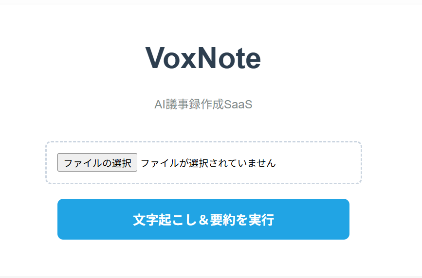
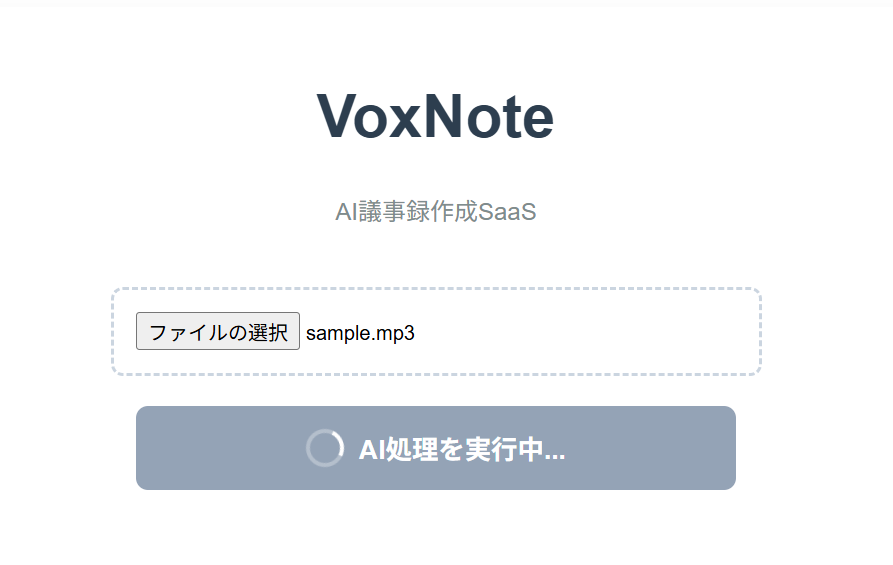
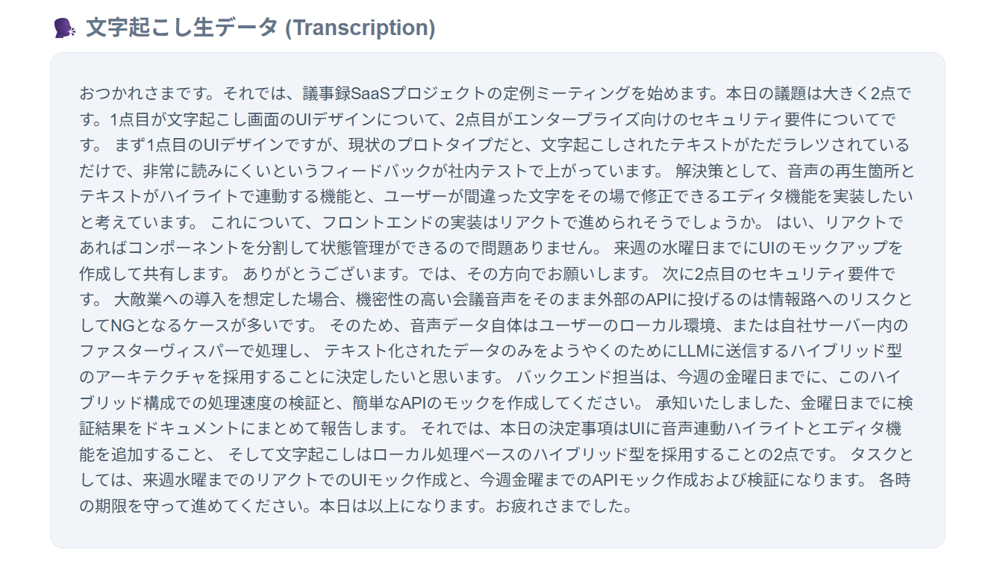
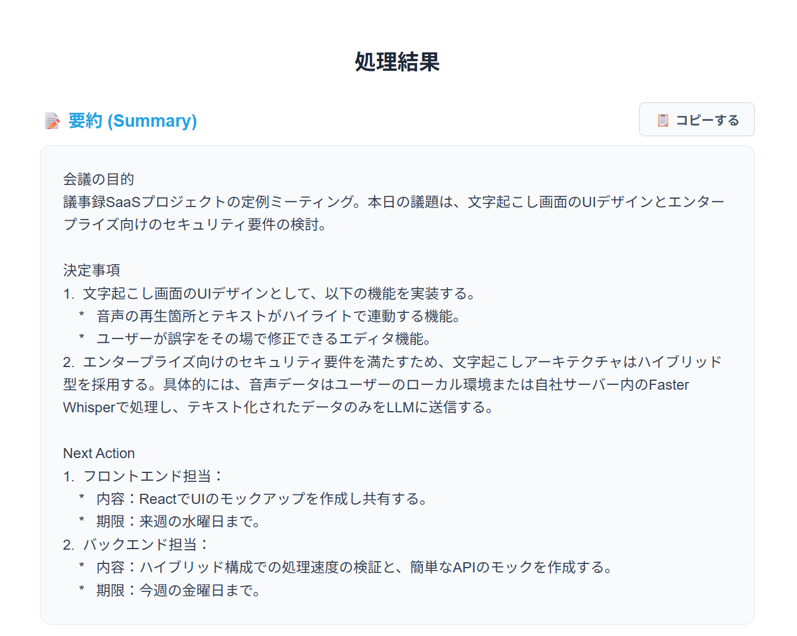
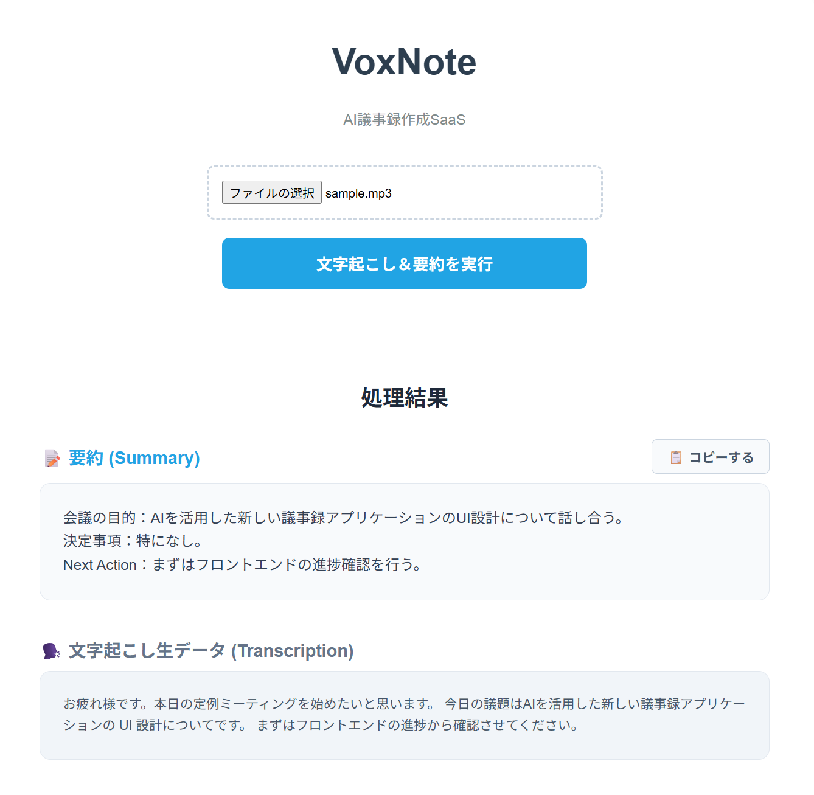

# VoxNote

会議音声をローカル環境で高精度に文字起こしし、クラウドLLMでビジネスフォーマットに要約するハイブリッド型AI議事録SaaSです。

## ローカル音声認識とクラウドLLMのハイブリッド構成
本システムは、音声処理と自然言語処理の役割を明確に分離したアーキテクチャを採用しています。

ファイルサイズの大きい音声データや、個人の声紋・環境音といった物理的な生データは外部に送信せず、自社サーバー（ローカル環境）の `faster-whisper` でテキスト化処理を完結させます。その後、抽出されたテキストデータのみを要約のためにLLM（Gemini API）へ送信します。これにより、重い音声データのアップロード待ち時間をなくし、システム全体の処理速度とリソース効率を最適化しています。

## デモ画面

1. **起動画面**  
   * 直感的でシンプルなファイルアップロードUI。
    
2. **解析実行中**
   * 処理の進行状態を視覚的に伝えるローディングアニメーション。
   * 
3. **文字起こし結果（生データ）**
   * ローカルAIによって高精度に文字起こしされたテキストデータ。
   * 
4. **要約結果（構造化データ）**
   * 生データをビジネスフォーマットに整形した要約結果。**ワンクリックでプレーンテキストとしてクリップボードにコピーできる機能**を搭載しています。
   * 
5. **短い音声の解析例**
   * 短時間の音声入力に対する、生データと要約の出力例。
   *

## ディレクトリ構成
本プロジェクトの主要なソースコード構成は以下の通りです。

```text
VoxNote/
├── backend/                 # FastAPIベースのバックエンドAPI
│   ├── core/
│   │   └── processor.py     # AI処理ロジック（Whisperでの文字起こしとGeminiでの要約）
│   ├── main.py              # サーバー設定、一時ファイルの保存・破棄、API通信窓口
│   └── requirements.txt     # Python依存パッケージ
├── frontend/                # React + Viteベースのフロントエンド
│   ├── src/
│   │   ├── App.jsx          # メインUIコンポーネント（アップロード、通信、結果表示）
│   │   └── main.jsx         # Reactアプリケーションの起動スイッチ
│   ├── index.html           # フロントエンドのベースとなるHTMLファイル
│   ├── package.json         # Node.js依存パッケージ
│   ├── package-lock.json    # 依存関係の厳密なバージョンロック
│   ├── eslint.config.js     # コード品質管理（Linter）設定
│   ├── vite.config.js       # Viteのビルド設定ファイル
│   └── .gitignore           # Git管理から除外するファイルのリスト
└── screenshot/              # デモ掲載用のスクリーンショット画像群
```

## 主な機能と技術詳細

* **高速なローカル文字起こし (Local Processing)**
  * オリジナルのOpenAI WhisperモデルをC++向けに最適化（CTranslate2）した **`faster-whisper`** を採用しています。高価なGPUを持たない一般的なPCのCPU環境でも、量子化（int8）技術により実用的な速度と省メモリでの文字起こしを実現しています。
  * 音声データはメモリ上に一時ファイル（`tempfile`）として展開され、文字起こしが完了した直後にOSレベルで即座に破棄される仕様です。
* **高精度な構造化要約 (Cloud LLM)**
  * `Gemini 2.5 Flash` の推論力を活用し、音声認識特有のノイズや「えーっと」などのフィラーを補正。「会議の目的」「決定事項」「Next Action」として即座に整理・出力します。
* **シームレスなUI/UX**
  * ReactとViteによる高速でモダンなフロントエンド。

## 使用技術 (Tech Stack)
* **Frontend:** React, Vite, Axios
* **Backend:** FastAPI, Python, Uvicorn
* **AI Models:** faster-whisper (Local), Google Gemini 2.5 Flash API (Cloud)

## 環境構築と起動方法 (Getting Started)

### 事前準備
1. Google AI StudioにてGemini APIキーを取得してください。
2. バックエンドの環境変数（システム環境変数、またはルートディレクトリの `.env` ファイル）に `GEMINI_API_KEY` を設定します。

### バックエンドの起動
```bash
cd backend
python -m venv venv
# Windows: .\venv\Scripts\activate
# Mac/Linux: source venv/bin/activate
pip install -r requirements.txt
python main.py
```

### フロントエンドの起動（別ターミナル）
```bash
cd frontend
npm install
npm run dev
```
起動後、ブラウザで `http://localhost:5173/` にアクセスしてください。

## 今後の展望
* **話者分離の実装:** LLMの高度な文脈推論能力を活用し、複数人の会議音声を「話者A」「話者B」と自動で識別する台本形式（会話録）出力機能の追加を予定しています。

## ライセンス (License)
This project is licensed under the Apache License 2.0 - see the [LICENSE](LICENSE) file for details.

---
**Created by Tatsuya Koyama**