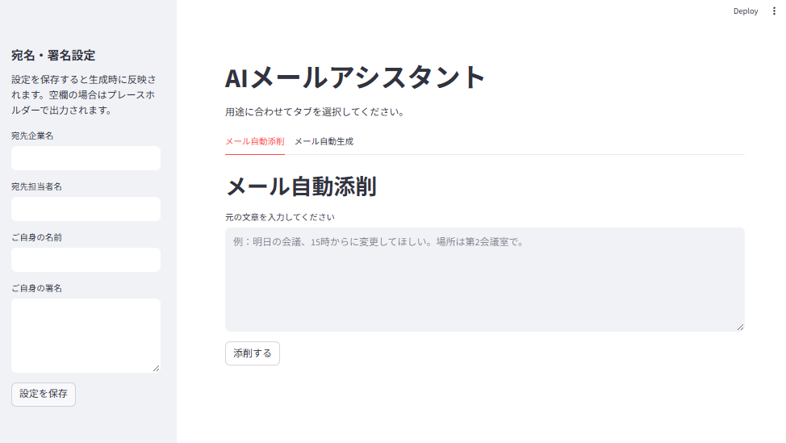
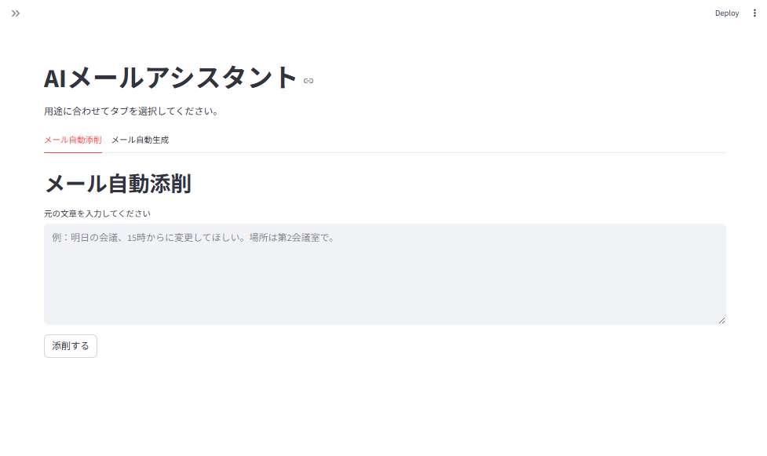
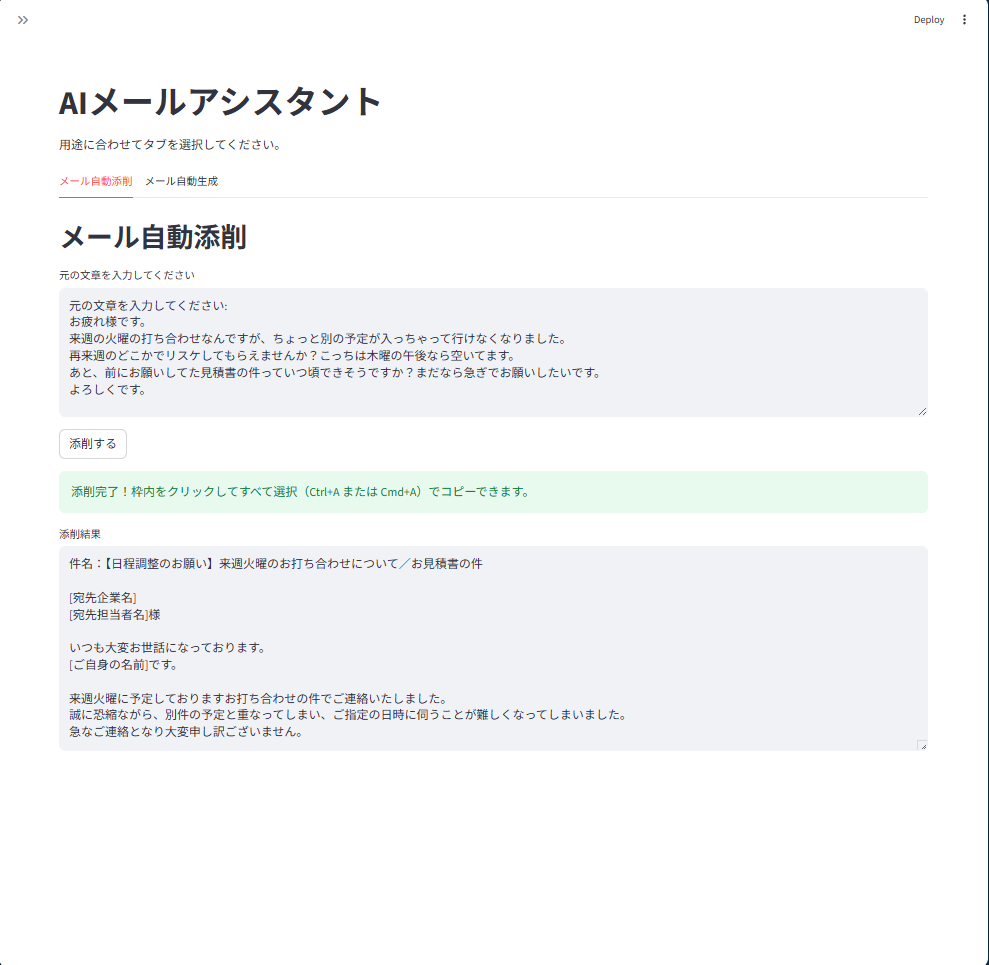
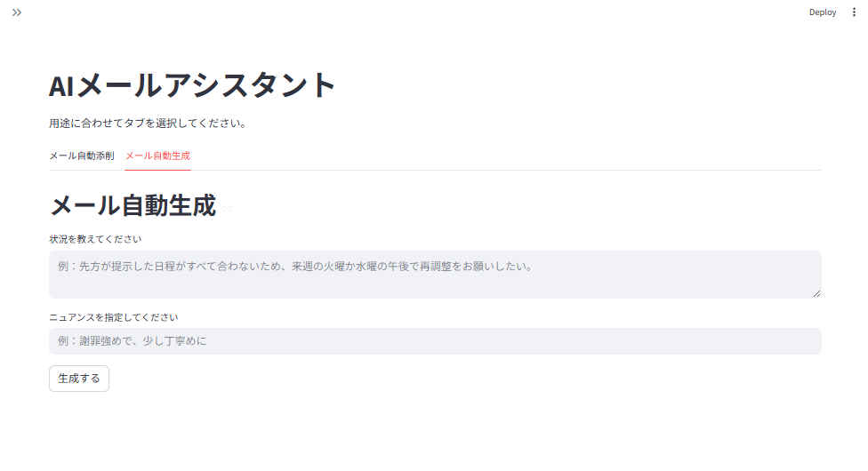
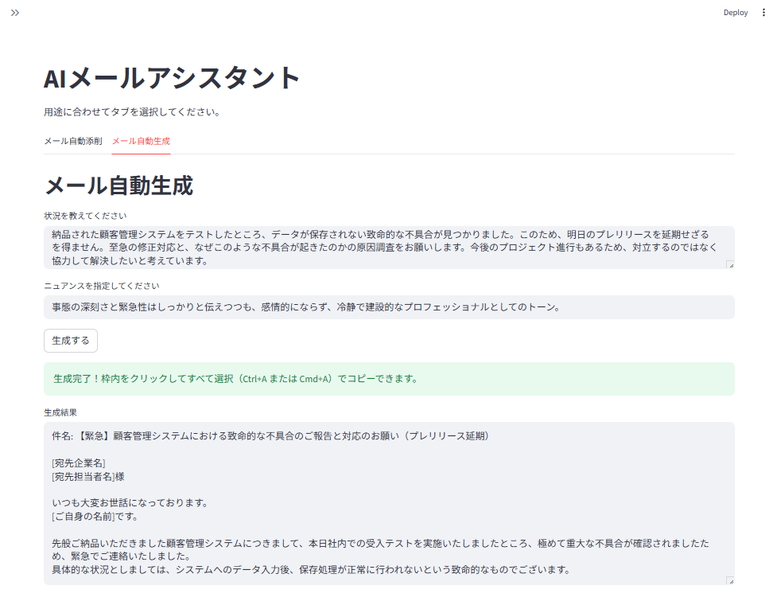

# gen-mail (AIメールアシスタント)

LLM（大規模言語モデル）の自然言語処理における挙動の検証、およびプロンプトエンジニアリングの実践的学習を目的として開発したテスト用アプリケーションです。
Google Gemini APIを活用し、ビジネスシーンにおけるメールの「自動添削」と「条件指定による自動生成」を行います。AIの出力におけるゆらぎや、プロンプトによる出力フォーマットの制御（Few-shotプロンプティング等）をテストする環境として機能します。

## アプリケーションの機能

本アプリケーションは、主に以下の機能を提供します。

### 1. 宛名・署名の事前設定と保存
サイドバーから、よく使用する宛名や自身の署名を事前に登録できます。設定内容はローカルに保存され、次回のアプリ起動時にも保持されます。これにより、生成されたメールをそのままコピー＆ペーストして使用できる状態を構築しています。



### 2. メール自動添削機能
箇条書きやカジュアルすぎるメモ書きのテキストを入力すると、文脈や意図を汲み取り、ビジネスマナーに沿った適切な敬語表現や構成に自動補正します。

| 入力前（起動直後） | 生成後（テスト結果） |
| :---: | :---: |
|  |  |

### 3. メール自動生成機能
伝えたい「状況」と、相手に与えたい「ニュアンス」を指定するだけで、件名を含めたビジネスメール全文をゼロから生成します。

| 入力前（起動直後） | 生成後（テスト結果） |
| :---: | :---: |
|  |  |

---

## ディレクトリ構成とファイル説明

```text
genmail/
├── screenshot/             # README用のアプリケーションUIスクリーンショット
│   ├── 起動画面1.png
│   ├── 起動画面2.png
│   ├── 宛名,署名設定画面.png
│   ├── メール自動添削テスト.png
│   └── メール自動生成テスト.png
├── test_result/            # AIの出力検証に用いたプロンプトと結果のログ
│   └── test.txt
├── .env                    # APIキーなど環境変数を保管するファイル（非公開）
├── app.py                  # Streamlitを用いたUI構築とメイン処理を実行するスクリプト
├── check_models.py         # 利用可能なGemini APIのモデル一覧を取得・確認するスクリプト
├── prompts.py              # AIの振る舞いを制御するシステムプロンプトを管理するスクリプト
├── README.md               # 本ドキュメント
├── requirements.txt        # アプリケーション実行に必要なPythonパッケージ一覧
└── settings.json           # ユーザーが入力した宛名・署名データを保存するファイル
```

---

## テストの狙いと評価結果

開発過程において、複雑な状況設定を用いた検証を実施しました。（詳細は `test_result/test.txt` を参照）

### 検証内容
- **メール自動生成のテスト:** 深刻なトラブル報告というネガティブな状況において、相手を過度に責めず、かつ緊急性を伝えるという「高度な感情のバランス」をAIがどう言語化するかを評価しました。
- **メール自動添削のテスト:** 敬語の誤り、一方的な要求、カジュアルすぎる表現など、ビジネス上「NG」とされる要素が多数含まれた文章を、AIがどのように解釈し、失礼のないビジネスメールへ再構築するかを評価しました。

### 評価と考察
検証の結果、「AIの解説を入れない」「1行ごとの不自然な改行を防ぐ」というプロンプトによる制御（Few-shotプロンプティング）が完璧に機能しており、検証用アプリのベースとして申し分のない状態に仕上がりました。

**【メール自動生成の評価】**
複雑な感情のバランスが要求される難しい状況設定でしたが、見事に意図を汲み取っています。
- **ニュアンスの再現:** 「事態の深刻さ」を伝えるために「誠に遺憾ながら」「システム根幹に関わる致命的な不具合」といった語彙を選択しつつも、「対立ではなく協力」という指定に対し、「貴社と協力し、早期解決に向けて尽力したい」という前向きな姿勢を明確に言語化できています。
- **フォーマットの遵守:** 指示通り、トピックごとに段落がまとまり、不要な行間の空行が完全に排除されています。件名やプレースホルダーもルール通りに出力されています。

**【メール自動添削の評価】**
ビジネス上不適切な表現を、元の要点を一切損なうことなく、適切なトーンへ変換しています。
- **意図の正確な抽出:** 「打ち合わせのキャンセル」「再来週木曜の提案」「見積書の催促」という3つの要点を漏らさず組み込んでいます。
- **文脈からの補完:** 元の文章にはなかった「急なご連絡となり大変申し訳ございません」といった、ビジネスメールとして当然入るべきクッション言葉や謝罪を、AIが状況から推論して自然に補完しています。
- **件名の自動生成:** 本文の添削にとどまらず、内容を的確に要約した件名まで自動で生成しており、そのままコピーして使えるという要件を高いレベルで満たしています。

---

## 今後の展望と拡張性

現在のテスト環境をベースに、AIの挙動制御やアプリケーションとしての実用性を高めるための以下の拡張を検討しています。

1. **Temperature（出力のランダム性）のUI調整機能:**
   AIの創造性や表現の揺らぎを制御するパラメータを画面上からスライダー等で操作できるようにし、回答の堅さや多様性がどう変化するかをリアルタイムで検証する機能の追加。
2. **別ドメインへの応用展開:**
   ここで確立した「テキストの意図を汲み取り、ルールに従ってチェック・修正する」というプロンプト設計の基盤を活かし、規約や契約書の法的整合性を確認するチェッカーツールなど、より専門的なテキスト解析アプリケーションへの応用。
3. **プロンプトのバージョン管理機能:**
   複数のプロンプトパターンをアプリ上で切り替え、それぞれの出力結果を比較検討できるA/Bテスト機能の実装。

---

## 使用技術スタック

- **言語:** Python 3.x
- **フロントエンド / UI:** Streamlit
- **AI / LLM API:** Google Gemini API (gemini-2.5-flash)
- **環境変数管理:** python-dotenv

---

## License

Copyright 2026 Koyama

Licensed under the Apache License, Version 2.0 (the "License");
you may not use this file except in compliance with the License.
You may obtain a copy of the License at

    http://www.apache.org/licenses/LICENSE-2.0

Unless required by applicable law or agreed to in writing, software
distributed under the License is distributed on an "AS IS" BASIS,
WITHOUT WARRANTIES OR CONDITIONS OF ANY KIND, either express or implied.
See the License for the specific language governing permissions and
limitations under the License.